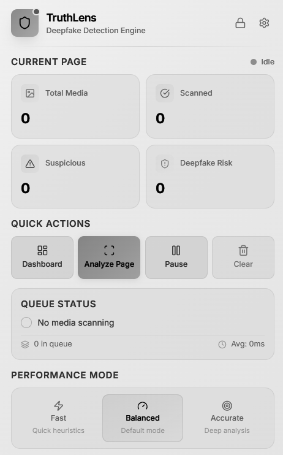
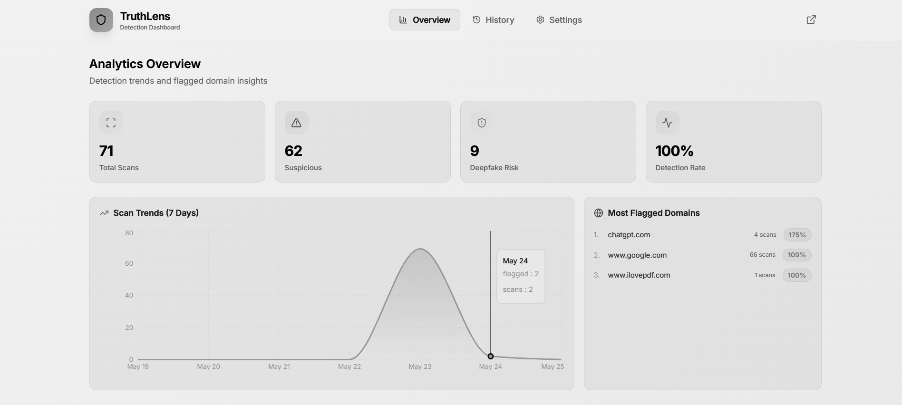
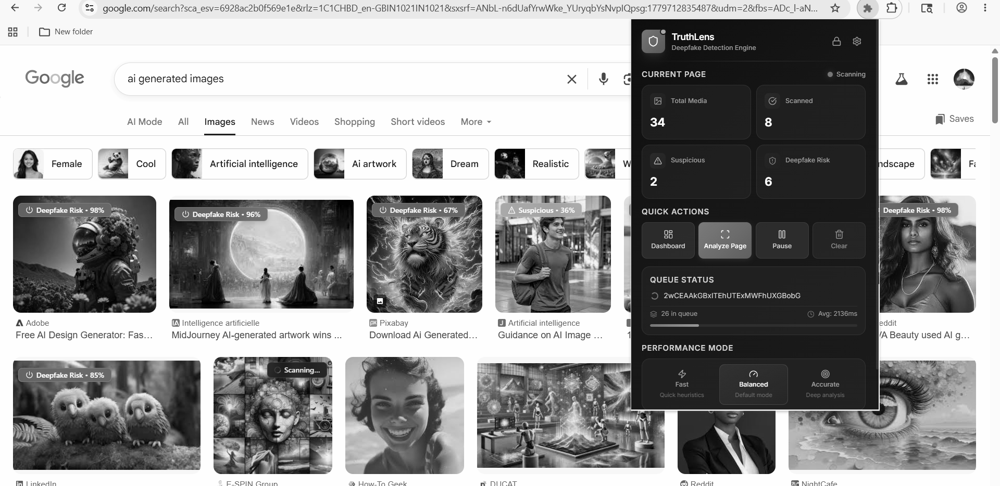

<div align="center">

# 🔍 TruthLens

### Real-Time Deepfake Detection Platform

*Detect manipulated images, videos, and audio directly from your browser using AI-powered media authenticity analysis.*


</div>

---

## 📌 Table of Contents

- [Overview](#-overview)
- [Screenshots](#-screenshots)
- [Key Features](#-key-features)
- [System Architecture](#-system-architecture)
- [Tech Stack](#-tech-stack)
- [Model Development](#-model-development)
- [Performance](#-performance)
- [Project Structure](#-project-structure)
- [Installation](#-installation)
- [API Reference](#-api-reference)
- [Future Enhancements](#-future-enhancements)
- [Limitations](#-limitations)
- [Ethical Considerations](#-ethical-considerations)
- [License](#-license)
- [Acknowledgements](#-acknowledgements)

---

## 🧠 Overview

**TruthLens** is an AI-powered browser extension that helps users identify manipulated and AI-generated media while browsing the web.

The extension automatically scans visible images, videos, and audio content on webpages, analyzes them using deep learning models, and classifies them as:

| Result | Meaning |
|--------|---------|
| ✅ **Authentic** | Media appears genuine |
| ⚠️ **Suspicious** | Potential signs of manipulation detected |
| ❌ **Fake** | Strong indicators of synthetic or manipulated content |

TruthLens combines a **browser extension**, **FastAPI backend**, and an optional **ONNX local inference engine** to deliver both high accuracy and low-latency detection.

---

## 📸 Screenshots


### Extension Popup


### Analytics Dashboard
(screenshots/dashboard2.png)(screenshots/dashboard3.png)

### Detection Result — Fake Media


### Detection Result — Authentic Media


---

## ✨ Key Features

### 🔍 Real-Time Media Scanning
Automatically analyzes visible media as users browse. Supported formats:
- 🖼️ Images
- 🎥 Videos
- 🎙️ Audio

---

### 🤖 Deep Learning Powered Detection
TruthLens utilizes multiple deep learning architectures:

| Model | Role |
|-------|------|
| **Vision Transformer (ViT)** | Primary production model |
| **EfficientNet** | Benchmark & evaluation model |
| **Custom CNN** | Lightweight fallback for resource-limited environments |

Each prediction includes a **confidence score** for full transparency:

```json
{
  "prediction": "Fake",
  "confidence": 0.92
}
```

---

### 🎥 Video Deepfake Detection
TruthLens uses a key-frame extraction pipeline to efficiently process video content:

1. Extract representative frames
2. Preprocess selected frames
3. Run inference on each frame
4. Aggregate frame-level predictions
5. Generate final verdict

> This approach reduces computational cost while maintaining high accuracy.

---

### 🎙️ Audio Manipulation Detection
Audio samples are converted to **spectrogram representations** and analyzed for synthetic speech artifacts:

```
Audio Extraction → Spectrogram Generation → Feature Preprocessing → Model Inference → Classification
```

---

### 📊 Analytics Dashboard
The built-in dashboard provides:

- Total scans performed
- Authentic vs. Fake distribution charts
- Detection history log
- Cached results viewer
- Confidence score analytics

---

### ⚡ Dual Inference Modes

| Mode | Engine | Benefit |
|------|--------|---------|
| ☁️ **Cloud Inference** | FastAPI on Railway | Maximum accuracy, centralized updates |
| 💻 **Local Inference** | ONNX Runtime | Lower latency, privacy-friendly, offline support |

Users can switch between modes from the extension settings at any time.

---

## 🏗️ System Architecture

```
┌─────────────────────┐
│   Browser Extension  │
└──────────┬──────────┘
           │
           ▼
┌─────────────────────┐
│   Media Extraction   │
│  Images │ Videos │ Audio
└──────────┬──────────┘
           │
           ▼
┌─────────────────────┐
│  Preprocessing Layer │
└──────────┬──────────┘
           │
           ▼
┌──────────────────────┐
│   Inference Engine   │
├──────────────────────┤
│  FastAPI Backend     │
│        OR            │
│    ONNX Runtime      │
└──────────┬───────────┘
           │
           ▼
┌─────────────────────┐
│    Classification    │
│  Authentic │ Suspicious │ Fake
└──────────┬──────────┘
           │
           ▼
┌─────────────────────┐
│  Dashboard & Popup   │
└─────────────────────┘
```

---

## 🛠️ Tech Stack

### Frontend (Browser Extension)


### Backend


### Machine Learning


### Deployment


### Datasets
- **FaceForensics++** — Primary training and evaluation
- Publicly available deepfake datasets for experimentation and validation

---

## 🔬 Model Development

### Primary Model — Vision Transformer (ViT)

The production model is built on **Vision Transformers** due to their superior ability to capture subtle spatial inconsistencies commonly present in manipulated media. ViT's attention mechanism excels at detecting long-range dependencies that CNNs often miss.

### Benchmark Model — EfficientNet

Used for performance comparison and cross-validation during development.

### Fallback Model — Custom CNN

A lightweight architecture designed for environments with limited compute resources, ensuring TruthLens remains accessible even on low-end hardware.

---

## 📈 Performance

| Metric | Value |
|--------|-------|
| **Accuracy** | ~86% |
| **Inference Type** | Real-Time |
| **Video Processing** | Key-Frame Based |
| **Backend** | FastAPI |
| **Deployment** | Railway |
| **Local Runtime** | ONNX |

---

## 📁 Project Structure

```
TruthLens/
│
├── extension/
│   ├── popup/          # Extension popup UI
│   ├── dashboard/      # Analytics dashboard
│   ├── content/        # Content scripts
│   ├── background/     # Background service worker
│   └── assets/         # Icons and static assets
│
├── backend/
│   ├── api/            # API route handlers
│   ├── services/       # Business logic layer
│   ├── models/         # ML model loaders
│   ├── utils/          # Helper utilities
│   └── main.py         # FastAPI entry point
│
├── ml/
│   ├── training/       # Model training scripts
│   ├── inference/      # Inference pipeline
│   ├── preprocessing/  # Data preprocessing
│   └── onnx/           # ONNX export and runtime
│
├── datasets/           # Dataset configs and references
├── docker/             # Docker configuration files
├── docs/               # Documentation and screenshots
│
├── Dockerfile
├── requirements.txt
└── README.md
```

---

## 🚀 Installation

### 1. Clone the Repository

```bash
git clone https://github.com/17Abhi005/truthlens.git
cd truthlens
```

### 2. Create a Virtual Environment

```bash
python -m venv venv
```

**Activate:**

```bash
# Windows
venv\Scripts\activate

# Linux / macOS
source venv/bin/activate
```

### 3. Install Dependencies

```bash
pip install -r requirements.txt
```

### 4. Start the Backend Server

```bash
uvicorn main:app --reload
```

### 5. Load the Browser Extension

1. Open **Chrome** and navigate to `chrome://extensions`
2. Enable **Developer Mode** (top-right toggle)
3. Click **Load Unpacked**
4. Select the `extension/` folder
5. The TruthLens extension is now ready

---

## 📡 API Reference

### Health Check

```http
GET /health
```

**Response:**
```json
{
  "status": "healthy"
}
```

---

### Image Detection

```http
POST /predict/image
```

---

### Video Detection

```http
POST /predict/video
```

---

### Audio Detection

```http
POST /predict/audio
```

---

### Local ONNX Inference

**Export model to ONNX:**
```bash
python export_onnx.py
```

**Run local inference:**
```bash
python local_inference.py
```

> Enable ONNX mode from the extension settings panel.

---

## 🚧 Future Enhancements

- [ ] Explainable AI (XAI) visualizations
- [ ] Manipulation heatmaps overlaid on media
- [ ] Support for additional synthetic media formats
- [ ] User reporting and community feedback system
- [ ] Federated learning for privacy-preserving model updates
- [ ] Multilingual audio analysis
- [ ] Livestream deepfake detection
- [ ] Continuous model retraining pipeline

---

## ⚠️ Limitations

- No deepfake detector can achieve 100% accuracy
- Results should be treated as **assistive**, not definitive
- Performance depends on media quality and compression levels
- New generative models may require retraining to maintain effectiveness

---

## ⚖️ Ethical Considerations

TruthLens is developed strictly for:

- 🔬 Research
- 📚 Education
- 🛡️ Misinformation mitigation
- 🌐 Media authenticity awareness

> **Disclaimer:** TruthLens should **not** be used as the sole basis for legal, journalistic, security, or regulatory decisions. Human verification remains essential.

---

## 👨‍💻 Author

**Abhishek**
*Developer & Machine Learning Engineer*

- Model Development & Deepfake Detection Research
- Browser Extension Development
- Backend Engineering
- ONNX Optimization
- Deployment & Infrastructure

---

## 📄 License

This project is licensed under the **MIT License**.
See the [LICENSE](./LICENSE) file for full details.

---

## 🙏 Acknowledgements

- [FaceForensics++](https://github.com/ondyari/FaceForensics) — Benchmark dataset
- [PyTorch](https://pytorch.org/) — Deep learning framework
- [FastAPI](https://fastapi.tiangolo.com/) — Backend framework
- [ONNX Runtime](https://onnxruntime.ai/) — Local inference engine
- [Railway](https://railway.app/) — Cloud deployment platform
- The broader Open Source AI Community

---

<div align="center">

### Why TruthLens?

*As AI-generated media becomes increasingly realistic, distinguishing authentic content from manipulated content grows harder every day.*

*TruthLens provides a practical, accessible, and privacy-conscious solution — empowering users to evaluate media authenticity directly within their everyday browsing experience.*

**By combining browser-native analysis, deep learning, and flexible deployment options, TruthLens helps users navigate an increasingly synthetic digital landscape with greater confidence.**

</div>
